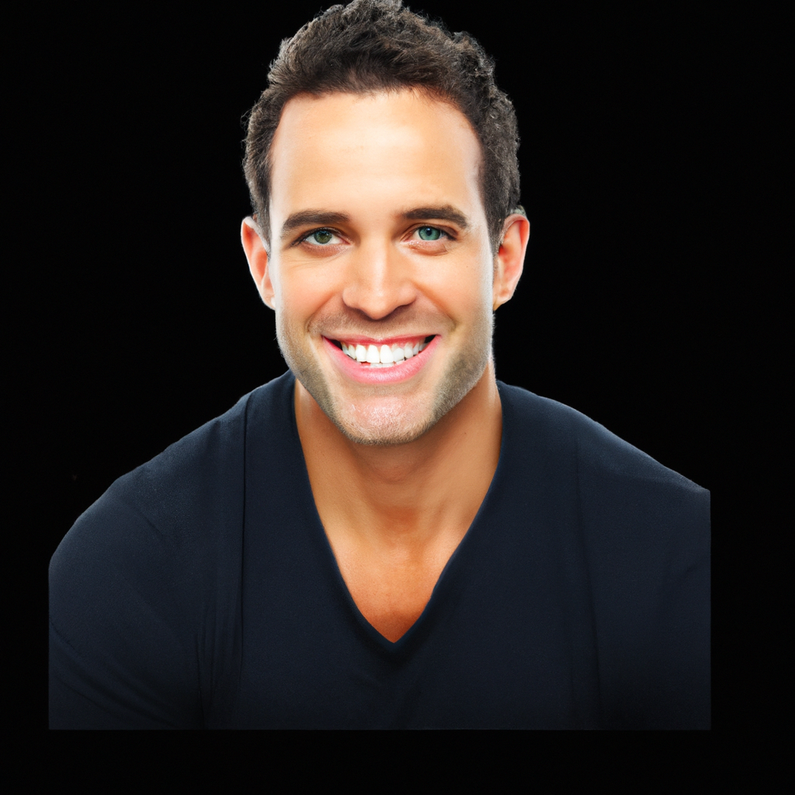

## Stable Diffusion

1. Words to pic
key:
* Input prompt

* pixel dimensions of output image "256x256" or "768x768",

    > 'image_dimensions': "768x768",

* Specify things to not see in the output
    * 'negative_prompt': ...,

*  Number of images to output.
    *  Range: 1 to 4

    > 'num_outputs': x,

* Number of denoising steps
    * Range: 1 to 500
    > 'num_inference_steps': 50,

* Scale for classifier-free guidance
    * Range: 1 to 20
    > 'guidance_scale': 7.5,

* Choose a scheduler.
    > 'scheduler': "DPMSolverMultistep",

*  Random seed. Leave blank to randomize the seed
    > 'seed': ...,

* Example, here we use prompt "Duke students portraits picture with face details and hair style" as input 
here is the outputs:

output(1)                               |  output(2)                          | output(3)                           | output(4)
:--------------------------------------:|:-----------------------------------:|:-----------------------------------:|:-----------------------------------:
          |       |       |  

      

those AI generate human face are really easy to tell the different with real human faces. 

2. pic to word 
import picture and find the elements in the pic and print it out.

## Dall-E-2
1. text to image 
The image generations endpoint allows you to create an original image given a text prompt. 
Generated images can have a size of 256x256, 512x512, or 1024x1024 pixels. Smaller sizes are faster to generate.
You can request 1-10 images at a time using the n parameter.
here is the result:
import promp: "one duke student's portrait picture"

2. image to image
The image variations endpoint allows you to generate a variation of a given image. which I believe would be the function we need to do the futher ML analysis.

here is the original picture and the generate picture. 
original picture                        |  Dall-E-2 generate picture
:--------------------------------------:|:-----------------------------------:
  |  